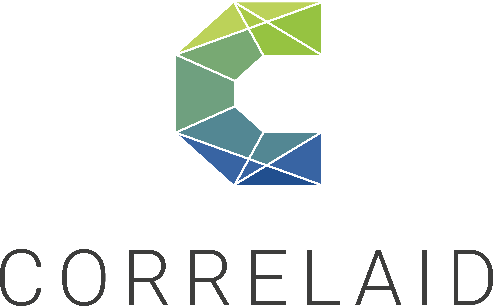

# Where to build new bike parking spots in Paris?

*This is the repository of the CorreAid project `paris-bikes` for the City of Paris.*

TODO project description

TODO project goals

TODO stakeholder list

## We thank
<p>
    
     
    
</p>

# Project setup - for developers

## Dash application

The is the web app of the Parking Demand Index. It is an interactive map, which allows you to select and combine different metrics to calculate and visualize parking demand for IRIS sectors in Paris. 

To start the Dash application server locally, from the root of this repo, execute:

```
python paris_bikes/dash_application.py
```

and navigate to http://localhost:5000 in your browser.

## Development environment

We use `python>=3.10` and [`poetry`](https://python-poetry.org/docs/basic-usage/) to manage our development environment.
`poetry` manages dependencies and makes it easy to create a virtual environment that is compatible with our package.
You can install `poetry` using `conda` or `pip`.

To setup a development environment:

```bash
poetry install
```

> If you are on Apple Silicon, you might have to install `gdal`, a dependency of `fiona`/`geopandas`.
You can do this with homebrew: `brew install gdal`

To activate the virtual environment:

```bash
poetry shell
```

## Data management

We use [DVC](https://dvc.org/) for data management and version control.
DVC is setup to store our data repository on our project's Google Drive (folder name `dvcstore`).

DVC is easy to use and follows a syntax similar to git.

**To install DVC:**

DVC is already installed if you followed the [Environment](#environment) setup.
If necessary, check [here](https://dvc.org/doc/install) for other installation methods.

**To get DVC-managed files from the remote repository:**

```bash
dvc pull
```

**To track a new data file with DVC:**

```bash
dvc add data/new_file.csv
git commit -m "Add new data file"
```

**To push new DVC-managed files to the remote repository:**

```bash
dvc push
```

**To sync DVC-managed files with the current git branch/commit:**

```bash
dvc checkout
```

A quick starting guide can be found [here](https://dvc.org/doc/start/data-management).

# Project management

## Useful links

- [Google Drive](https://drive.google.com/drive/folders/1mmsON23Bz-7xB3Y3qGHC0kqSKG6aXUVr)
- [Slack channel](https://correlaid.slack.com/archives/C03NAN24GDN)
- [Planning Mural](https://app.mural.co/t/correlaid9916/m/correlaid9916/1657610032235/e86d4422b5be6421cd132e9c47a3eb82f0d191f3)
- [Team Manifesto Mural](https://app.mural.co/t/correlaid9916/m/correlaid9916/1657265397906/558401920c32987ce75a2853aaea0e06aa6e94e2)
- [CorrelAid docs](https://docs.correlaid.org/)

## Definition of Done

How do we know that we're really done with a task and have not forgotten anything important? In this project, we use the following Definition of Done:

- **Functionality**: the code runs / has no defects
- **Code documentation**: the code itself is properly documented
- **Data documentation**: metadata of raw files should be documented in `data/metadata.md`
- **Project documentation** such as README/wiki is updated where necessary
    - scope/features of project: what does this project do? How can you run it?
    - setup of project
        - data requirements (files, folders)
        - software requirements (packages, other tooling)
    - developer documentation: things like the definition of done, agreed upon standards, ...
- **Peer Review**: someone else has had a look at the code and tested it on their machine
- **Git**: the code is ready to be merged to the main branch or is already on the main branch
- **Clean Repository**: old, outdated code and files are deleted
- **Consistent code style**: code is styled consistently and linted using `black`
- **Unit tests**
    - existing unit tests pass
    - if possible: new code is properly tested
    - unit test coverage >xx%

See [here](https://github.com/CorrelAid/definition-of-done) for more details.
