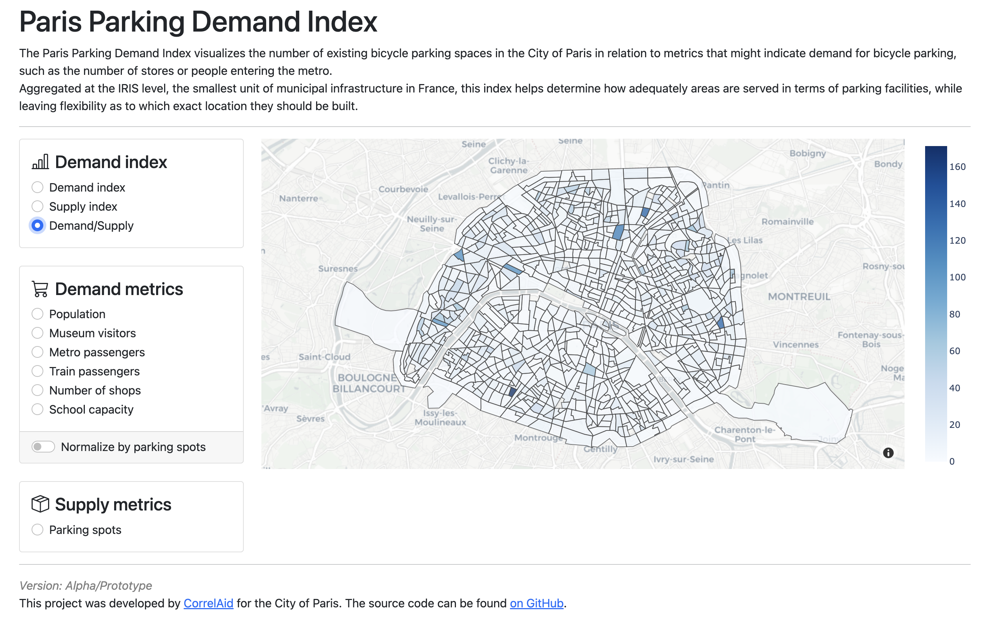

# "Where to build new bicycle parking spots in Paris? Supporting data-driven decision-making with open data"

This is the repository of the CorreAid project `paris-bikes` in collaboration with the City of Paris.

#### Table of Contents
- ["Where to build new bicycle parking spots in Paris? Supporting data-driven decision-making with open data"](#where-to-build-new-bicycle-parking-spots-in-paris-supporting-data-driven-decision-making-with-open-data)
            - [Table of Contents](#table-of-contents)
    - [Context](#context)
    - [Paris Parking Demand Index](#paris-parking-demand-index)
        - [Screenshot](#screenshot)
    - [Blog article](#blog-article)
    - [Contributors and supporters](#contributors-and-supporters)
        - [We thank](#we-thank)
    - [Project setup](#project-setup)
        - [Dash application](#dash-application)
        - [Development environment](#development-environment)
        - [Data management](#data-management)
        - [Deploying the application to Google Cloud Run](#deploying-the-application-to-google-cloud-run)
    - [Project management](#project-management)
        - [Useful links](#useful-links)
        - [Definition of Done](#definition-of-done)

## Context

Metropolitan areas like the city of Paris are facing important **challenges transitioning to green mobility**. Space to build new infrastructures for alternative transport, like bicycle lanes or parking spots, is limited. Often, existing infrastructure has to be repurposed, and there are lots of local restrictions. In the last years, the City of Paris has implemented [ambitious goals in terms of mobility transition](https://www.paris.fr/pages/paris-a-velo-225), which will [continue in the years to come](https://www.paris.fr/pages/un-nouveau-plan-velo-pour-une-ville-100-cyclable-19554).

Paris, and France on a regional and national level, have also started publishing **lots of open data** on a multitude of platforms, like [data.gouv.fr](https://www.data.gouv.fr/fr/) or [parisdata.opendatasoft.com](https://parisdata.opendatasoft.com/).

This raises the question, if (or rather *how*) all of this **data could be used to support decision-making**, e.g. on where to **build new bike parking spots**.

And this is where CorrelAid comes in! *(You don't know CorrelAid? Have a [look here](https://correlaid.org/en/))*

After a first contact for [Open Data Day 2022](https://github.com/CorrelAid/open_data_22_paris) the mobility agency "Mission Vélo" (Mission Bike) and the innovation office of the City of Paris teamed up with an international group of CorrelAid volunteers to work on this question.

From July to December 2022, the team explored open data repositories, researched approaches of other cities, brainstormed, discussed, designed, and coded. The results can be found in this repository :)

## Paris Parking Demand Index

The Paris Parking Demand Index is a web app that visualizes the number of existing bicycle parking spaces in the City of Paris in relation to metrics that might indicate demand for bicycle parking, such as the number of stores or people entering the metro.
Aggregated at the IRIS level, the smallest unit of municipal infrastructure in France, this index helps determine how adequately areas are served in terms of parking facilities, while leaving flexibility as to which exact location they should be built.
All data used in this project is from French open data portals.

Have a look [here](https://paris-bikes-wfiz3bgwsa-ew.a.run.app/) at a hosted version of the Parking Demand Index (it might take up to a minute to load).

You can also clone the repository and work with the code yourself. See section [Project setup](#project-setup).

### Screenshot
<table><tr><td>
   
</td></tr></table>

## Blog article

Would you like to learn more about the project, and how we worked together as a group of volunteers to address the challenge of supporting decision-making in the City of Paris with open data? 

Check out the blog article about this project! *[Link will follow soon]*

## Contributors and supporters

Meet the project team! (*listed in alphabetical order*)
- **Team Data**: [@akashrajkn](https://github.com/akashrajkn), [@dietrichsimon](https://github.com/dietrichsimon), [@Goldmariek](https://github.com/Goldmariek), [@katoss](https://github.com/katoss), [@operte](https://github.com/operte)
- **Team Research**: [@astrid4559](https://github.com/astrid4559), [@KarinRoe](https://github.com/KarinRoe),[@Liyubov](https://github.com/Liyubov), [@mpadge](https://github.com/mpadge),[@ryanrakusin](https://github.com/ryanrakusin)

Special thanks go to [@friep](https://github.com/friep) from CorrelAid for helping us setting up the project, to the CorrelAid organization, to Mélanie, Benoît, and Mourad from the City of Paris for taking the time to collaborate with us and thus giving us the chance to work on this interesting project, and to Gaëll from the Learning Planet Institute for setting up the contact, and to the Learning Planet Institute for having CorrelAid as a student club and enabling us to use rooms and infrastructure.

### We thank

<p align="center">
     &ensp;&ensp;&ensp;&ensp;
     &ensp;&ensp;&ensp;
        
</p>

## Project setup

### Dash application

The is the web app of the Parking Demand Index. It is an interactive map, which allows you to select and combine different metrics to calculate and visualize parking demand for IRIS sectors in Paris. 

To start the Dash application server locally, from the root of this repo, execute:

```
python paris_bikes/dash_application.py
```

and navigate to http://localhost:5000 in your browser.

### Development environment

We use `python>=3.10` and [`poetry`](https://python-poetry.org/docs/basic-usage/) to manage our development environment.
`poetry` manages dependencies and makes it easy to create a virtual environment that is compatible with our package.
You can install `poetry` using `conda` or `pip`.

To setup a development environment:

```bash
poetry install
```

> If you are on Apple Silicon, you might have to install `gdal`, a dependency of `fiona`/`geopandas`.
You can do this with homebrew: `brew install gdal`

To activate the virtual environment:

```bash
poetry shell
```

### Data management

We use [DVC](https://dvc.org/) for data management and version control.
DVC is setup to store our data repository on our project's Google Drive (folder name `dvcstore`). 

**Important:** We stored the files for dvc in a private cloud from CorrelAid, so you won't be able to access the raw data unless you have access to that cloud. However, the [`feature.geojson`](data/feature/feature.geojson) file, which you need to run the dash application, is in this GitHub repository. Since we used open data, all the raw data can be found online, see [`metadata.md`](data/metadata.md).

DVC is easy to use and follows a syntax similar to git.

**To install DVC:**

DVC is already installed if you followed the [Environment](#environment) setup.
If necessary, check [here](https://dvc.org/doc/install) for other installation methods.

> If you are a member of the project, copy the `config.local` file that can be found in the shared Google Drive folder into the `.dvc` folder.

**To get DVC-managed files from the remote repository:**

```bash
dvc pull
```

**To track a new data file with DVC:**

```bash
dvc add data/new_file.csv
git commit -m "Add new data file"
```

**To push new DVC-managed files to the remote repository:**

```bash
dvc push
```

**To sync DVC-managed files with the current git branch/commit:**

```bash
dvc checkout
```

A quick starting guide can be found [here](https://dvc.org/doc/start/data-management).

### Deploying the application to Google Cloud Run

The application has been deployed on Google Cloud Run and can be found [here](https://paris-bikes-wfiz3bgwsa-ew.a.run.app/).

To deploy a new version:

1. Make sure you have access to the project (contact @operte)
2. Make sure you are familiar with the [Cloud Run Python guide](https://cloud.google.com/run/docs/quickstarts/build-and-deploy/deploy-python-service?hl=en), that you have the Google Cloud CLI installed and initialized
3. Make sure that `.dockerignore` and `Dockerfile` are up-to-date (and ideally try them out locally using e.g. Docker)
4. Deploy using `gcloud run deploy`

## Project management

### Useful links

- [Google Drive](https://drive.google.com/drive/folders/1mmsON23Bz-7xB3Y3qGHC0kqSKG6aXUVr)
- [Slack channel](https://correlaid.slack.com/archives/C03NAN24GDN)
- [Planning Mural](https://app.mural.co/t/correlaid9916/m/correlaid9916/1657610032235/e86d4422b5be6421cd132e9c47a3eb82f0d191f3)
- [Team Manifesto Mural](https://app.mural.co/t/correlaid9916/m/correlaid9916/1657265397906/558401920c32987ce75a2853aaea0e06aa6e94e2)
- [CorrelAid docs](https://docs.correlaid.org/)

### Definition of Done

How do we know that we're really done with a task and have not forgotten anything important? In this project, we use the following Definition of Done:

- **Functionality**: the code runs / has no defects
- **Code documentation**: the code itself is properly documented
- **Data documentation**: metadata of raw files should be documented in `data/metadata.md`
- **Project documentation** such as README/wiki is updated where necessary
    - scope/features of project: what does this project do? How can you run it?
    - setup of project
        - data requirements (files, folders)
        - software requirements (packages, other tooling)
    - developer documentation: things like the definition of done, agreed upon standards, ...
- **Peer Review**: someone else has had a look at the code and tested it on their machine
- **Git**: the code is ready to be merged to the main branch or is already on the main branch
- **Clean Repository**: old, outdated code and files are deleted
- **Consistent code style**: code is styled consistently and linted using `black`

See [here](https://github.com/CorrelAid/definition-of-done) for more details.
